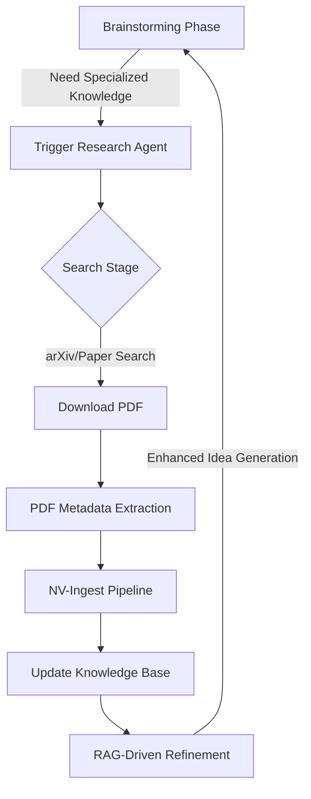

# [NeuroX-OS] Autonomous Research Agent Workflow

본 문서에서는 브레인스토밍 중 실시간으로 학술적 근거를 확보하고 RAG 시스템을 업데이트하는 **'자동 연구 에이전트(Autonomous Research Agent)'**의 작동 워크플로우를 정의합니다.

## 1. 에이전트 핵심 구성 (Core Components)
에이전트는 크게 3가지 모듈로 구성됩니다:
- **Searcher**: Academic MCP 또는 arXiv API를 통해 최신 논문 검색.
- **Acquirer**: 논문 PDF를 다운로드하고 메타데이터 추출.
- **Ingestor**: 다운로드된 문서를 `kb_ingest.py` (NV-Ingest)를 통해 로컬 RAG 시스템에 즉시 통합.

## 2. 워크플로우 루프 (Operational Loop)



### 단계별 상세 설명
1. **Trigger (트리거)**: 
   - 메인 에이전트(Antigravity)가 아이디어 생성 중 "Continual Learning"이나 "Hippocampal Replay"와 같이 심도 있는 학술적 근거가 필요한 키워드를 감지하면 자동 실행됩니다.
2. **Search & Download (검색 및 다운로드)**:
   - `scripts/arxiv_researcher.py`가 가동되어 키워드 기반 최신 논문을 3~5개 검색하고 `docs/02_literature/papers/` 폴더에 저장합니다.
3. **Automatic Ingestion (자동 인덱스)**:
   - 다운로드 직후 `kb_ingest.py`를 실행하여 새로 확보된 지식을 SQLite FTS5 인덱스에 추가합니다.
4. **Synthesis (종합 및 반영)**:
   - 업데이트된 RAG를 사용하여 "최신 논문 X(2025)에 따르면..."과 같은 인용과 함께 아이디어를 정교화합니다.

## 3. 실행 방법 (Example Command)
현재 구현된 에이전트는 다음과 같이 독립적으로 또는 메인 프로세스 내부에서 호출될 수 있습니다:

```bash
# 특정 주제에 대한 자동 연구 및 RAG 업데이트 실행
python3 scripts/arxiv_researcher.py "Hippocampal Replay Continuous Learning AI"
```

## 4. 향후 확장 계획
- **Visual Analysis**: Gemini Vision을 연동하여 다운로드된 논문의 Figure(그림)를 직접 분석하고 결과에 반영.
- **Semantic Scholar Integration**: arXiv 외에 인용 지수가 높은 저널 논문 검색 지원.
