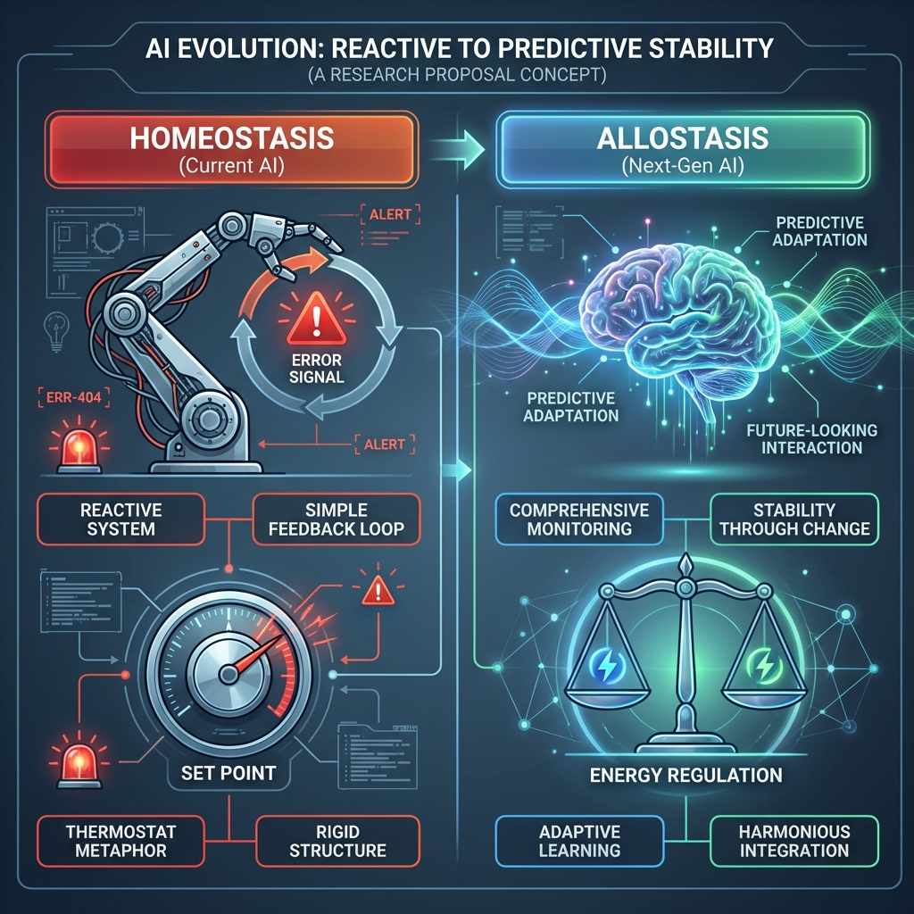

# 제3장: 내수용 감각장 및 알로스태틱 뉴로트윈 (Allostatic Neuro-Twin)

## 3.1 개요: 예측적 생존 본능 (Predictive Allostasis)
기존의 AI 에이전트나 웰니스 앱은 문제가 발생한 후 반응하는 **Homeostasis(항상성, Reactive)** 모델에 그쳤음. 본 과제는 시스템이 변화하는 미래 환경을 예측하고 사전에 에너지를 조절하는 **Allostasis(알로스태시스, Predictive Regulation)** 개념을 도입하여, 에이전트의 생존성을 극대화함.

## 3.2 시스템 구조: Neuro-Twin Loop
사용자의 신체 및 환경 데이터를 실시간으로 미러링하는 **"Digital Neuro-Twin"**을 구축함.

### 3.2.1 Ubiquitous Sensing (입력)
-   **Passive Sensing**: 스마트워치/글래스 등 웨어러블 기기를 통해 심박 변이도(HRV), 피부 전도도(EDA) 등 자율신경계 신호를 수동적으로 수집함.
-   **Active Proprioception**: 사용자의 자세, 움직임 등 고유감각 정보를 통합하여 신체 에너지 소모량을 정밀 추정함.
-   **Neural Proxy**: 뇌파(EEG)와 자율신경계 신호 간의 상관관계를 매핑하여, 웨어러블 신호만으로도 뇌의 각성(Arousal) 상태를 역추론하는 대리 모델(Proxy Model)을 가동함[JMIR 2025].

### 3.2.2 Energy Landscape Inference (처리)
뇌 상태를 고차원 **"Energy Landscape(에너지 지형)"** 상의 좌표로 매핑함.
-   **Pathological Attractor**: 우울, 불안, 또는 시스템 과부하 상태를 '빠져나오기 힘든 깊은 골짜기(Attractor)'로 정의함.
-   **Allostatic Load**: 현재 상태가 지속될 경우 시스템에 가해질 누적 부하(Load)를 예측 시뮬레이션함.

### 3.2.3 Predictive Nudge (개입)
시스템이나 사용자가 병리적 끌개(Attractor)로 진입하기 전, 선제적으로 개입함.
-   **Intervention**: 조명, 온도 조절 또는 사용자에게 알림(Nudge)을 제공하여, 에너지 지형 상의 '안전 지대'로 궤적을 수정함[Psychology Today 2025].

## 3.3 기대 효과
단순한 헬스케어를 넘어, 극한 환경(재난, 우주 등)에서 인간과 AI 시스템의 공생(Symbiosis)을 가능케 하는 **"Energy-Efficient Robust Intelligence"**를 구현함.
